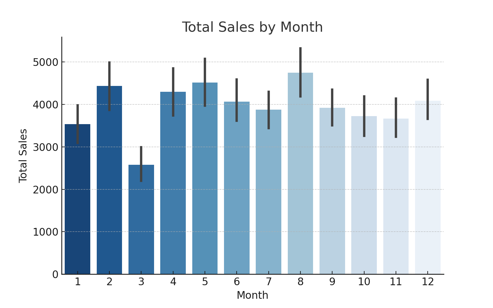

# 🛒 Sales Prediction & Analysis Using AI  

## 📌 Table of Contents  
- [📌 Project Overview](#-project-overview)  
- [🚀 Features](#-features)  
- [📊 Data Insights](#-data-insights)  
- [🔧 Technologies Used](#-technologies-used)  
- [🎯 Model Performance](#-model-performance)  
- [📥 How to Use](#-how-to-use)  
- [🚀 Future Enhancements](#-future-enhancements)  
- [🏆 Author](#-author)  

---

## 📌 Project Overview  
This project uses **Machine Learning** to analyze and predict sales trends in a candy store.  
We built a **Linear Regression Model** to forecast sales based on historical data.  

🔹 **Goal:** Predict future sales based on past trends  
🔹 **Techniques Used:** Data Analysis, Machine Learning, and Visualization  
🔹 **Output:** A trained ML model that forecasts sales, along with an interactive report  

---

## 🚀 Features  
✅ **Sales Data Analysis:** Identify top-selling products & seasonal trends  
✅ **Machine Learning Model:** Predict future sales with **Linear Regression**  
✅ **Data Visualization:** Graphical representation of sales performance  
✅ **Automated Reports:** Exportable **Excel reports** for decision-making  

---

## 📊 Data Insights  
The dataset contains **daily sales transactions** from a jelly candy shop.  
The analysis helps in:  
✔️ Identifying **bestselling products**  
✔️ Finding **seasonal trends in sales**  
✔️ Forecasting **future sales demand**  

### **🔹 Most Sold Products**
| Product | Total Sales (Units) |
|---------|---------------------|
| 🍓 Strawberry Jelly | 350 |
| 🍏 Apple Jelly | 300 |
| 🍊 Orange Jelly | 280 |
| 🍇 Grape Jelly | 260 |
| 🍋 Lemon Jelly | 240 |

---

## 🔧 Technologies Used  
- 🐍 **Python** (Data Processing & Modeling)  
- 📊 **Pandas & NumPy** (Data Analysis)  
- 📈 **Matplotlib & Seaborn** (Data Visualization)  
- 🤖 **Scikit-learn** (Machine Learning)  
- 📝 **Excel Reports** (Exporting results)  

---

## 🎯 Model Performance  
| Metric | Value |
|--------|-------|
| **Mean Absolute Error (MAE)** | 3.26 |
| **Mean Squared Error (MSE)** | 17.75 |
| **R-Squared (R²)** | 0.98 |

**💡 Interpretation:** The model has **high accuracy** (98%) in predicting sales trends! 🚀  
